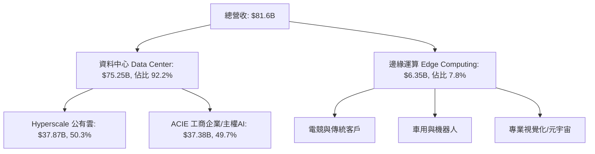

# NVIDIA (NVDA) Q1 FY2027 財報深度解析與策略評估
> **報告時間**：2026年5月21日（美東時間 2026年5月20日 盤後公布）  
> **會計季度**：2027 財年第一季度（截至 2026年4月26日）

NVIDIA（輝達）於昨日（2026年5月20日）公布了令人驚豔的 2027 財年第一季（Q1 FY2027）財務報告。本次財報不僅在營收與獲利上雙雙大幅超越市場預期，更揭示了 NVIDIA 在 AI 基礎建設以及產品迭代（Blackwell / Rubin）上的強勁動能。

以下為本季財報的深度解析，涵蓋**財務表現**、**業務板塊重組**、**產品週期與產能限制**、**股東回饋**及**未來投資價值評估**。

---

## 一、 核心財務表現：再創歷史新高

### 1. 關鍵財務指標摘要
NVIDIA 本季錄得創紀錄的營收與獲利，各項指標對比去年同期（YoY）與上季（QoQ）均呈現爆發式增長：

| 財務指標 (USD) | Q1 FY2027 實際值 | 去年同期 (YoY) | 上季 (QoQ) | 市場預期 (Consensus) | 表現評估 |
| :--- | :--- | :--- | :--- | :--- | :--- |
| **總營收** | **$81.60 Billion** | 📈 +85% | 📈 +20% | ~$79.5B | **優於預期** |
| **GAAP 毛利率** | **74.9%** | 🟡 持平 | 🟡 略降 | ~74.5% | 符合高水準 |
| **Non-GAAP 毛利率** | **75.0%** | 🟡 持平 | 🟡 略降 | ~75.0% | 符合預期 |
| **GAAP 淨利** | **$58.32 Billion** | 📈 大幅成長 | 📈 大幅成長 | - | **異常暴增（見後文解析）** |
| **Non-GAAP 淨利** | **$45.55 Billion** | 📈 穩健成長 | 📈 穩健成長 | - | **符合高成長趨勢** |
| **GAAP 稀釋 EPS** | **$2.39** | 📈 +120% | 📈 +32% | - | 超越預期 |
| **Non-GAAP 稀釋 EPS** | **$1.87** | 📈 +80% | 📈 +15% | ~$1.76 - $1.77 | **優於預期** |

---

### 2. 🧐 財務奇觀：為何 GAAP 淨利（$58.3B）遠高於 Non-GAAP（$45.5B）？
通常情況下，公司的 Non-GAAP 獲利會高於 GAAP，因為 Non-GAAP 會扣除股權激勵（SBC）等非現金支出。然而，NVIDIA 本季出現了罕見的反轉，GAAP 淨利比 Non-GAAP 高出近 **128 億美元**。這主要由兩大關鍵因素驅動：

> [!IMPORTANT]
> **因素一：巨額非營業投資收益（Other Income, Net）**
> * NVIDIA 本季在 GAAP 財報中的「其他淨收益」高達 **$15.93 Billion**（去年同期僅 $0.27B）。
> * 這筆收益主要來自其持有的股權證券價值重估，包含：
>   * **$13.40 Billion** 的上市股權證券未實現增值（如 ARM 等公開持股的股價飆升）。
>   * **$2.60 Billion** 的非上市股權證券未實現估值調升。
> * **處理方式**：由於這些投資收益屬於非核心業務的金融資產波動，NVIDIA 在計算核心業務表現的 Non-GAAP 指標時，**將這 $15.93B 的投資收益完全剔除**，導致 Non-GAAP 淨利顯著低於 GAAP。

> [!NOTE]
> **因素二：Non-GAAP 會計政策調整（不再剔除股權激勵費用）**
> * 自 Q1 FY2027 起，NVIDIA 調整了 Non-GAAP 的計算定義，**不再剔除股權激勵費用（Stock-Based Compensation, SBC）**，以提高與同業的財報可比性。這使 Non-GAAP 的營業費用增加，進一步拉低了 Non-GAAP 淨利。

---

## 二、 業務板塊解析：全新架構登場

從本季度開始，NVIDIA 為了更精準反映其轉型為「AI 工廠與系統平台提供商」的定位，重組了營收匯報板塊，主要劃分為 **資料中心 (Data Center)** 與 **邊緣運算 (Edge Computing)** 兩大核心板塊。

### 1. 資料中心（Data Center）：高歌猛進，主權 AI 崛起
*   **營收金額**：創紀錄的 **$75.25 Billion**（佔總營收 92.2%），年增長（YoY）達 **92%**，季增長（QoQ）達 **21%**。
*   **全新子版塊拆解**：
    *   **Hyperscale（大型雲服務商）**：營收 **$37.87 Billion**（佔資料中心 50.3%）。包含 Microsoft、Google、AWS、Meta 等科技巨頭，本季持續大力擴建 GPU 基礎設施。
    *   **ACIE（AI Clouds, Industrial, and Enterprise，AI 雲、工業與企業）**：營收 **$37.38 Billion**（佔資料中心 49.7%）。這顯示 NVIDIA 的客戶結構已成功去中心化，不再純粹依賴少數幾家雲端巨頭，大型企業、自主 AI 雲、醫療與汽車工業的採購佔了半壁江山。
*   **主權 AI（Sovereign AI）**：納入在 ACIE 板塊中。黃仁勳指出，各國政府為維護資料主權，建立本國語言模型的「主權 AI 工廠」採購動能極強，本季主權 AI 相關營收**年增率超過 80%**。
*   **運算 vs 網路**：
    *   **資料中心運算（Compute）**營收達 **$60.40 Billion**，主要受 Blackwell B-series 系統與 Hopper 系列（H200）的混合出貨驅動。
    *   **網路（Networking）**營收達到創紀錄的 **$14.85 Billion**。其中 **Spectrum-X Ethernet（以太網）** 平台出貨爆發，證明 NVIDIA 在非 InfiniBand 傳統以太網市場的滲透戰術獲得巨大成功，與其交換機產品形成強大生態綁定。

### 2. 邊緣運算（Edge Computing）：穩健整合
*   **營收金額**：**$6.35 Billion**，年增長 **29%**，季增長 **10%**。
*   **結構變化**：NVIDIA 將傳統的 Gaming（遊戲）、Professional Visualization（專業視覺化）、Automotive（車用）及 OEM 等邊緣硬體版塊整合為「邊緣運算」。這表明電競與車用晶片雖仍穩健，但在資料中心洪流下已退居輔助地位，未來邊緣端的核心看點將是邊緣 AI（Edge AI）與具身智能（Robotics）。

---

## 三、 產品週期：Blackwell 供不應求，下一代 Rubin 已在路上

### 1. Blackwell 晶片：史上最速產品坡道 (Ramp)
*   **需求呈「拋物線」增長**：黃仁勳形容，隨著「代理型 AI (Agentic AI)」時代的來臨，市場對 Blackwell 的需求已呈現拋物線式的瘋狂成長。
*   **產能瓶頸依舊**：目前最主要的限制仍在**供應鏈產能**（特別是 TSMC 的 CoWoS 先進封裝與高頻寬記憶體 HBM3e 產能）。高階 Blackwell 系統（如 NVL72）的客戶配額已**超額認購至 2027 財年下半年（即 2026 年底至 2027 年初）**。
*   **Hopper 的過渡**：Hopper 平台（H200）依然保持強勁出貨，並未因 Blackwell 的推出而出現嚴重的「空窗期」，顯示算力缺口依然龐大。

### 2. 驚喜預告：下一代「Rubin」架構
*   NVIDIA 在本次會議中再度重申了其**一年一次（One-year cadence）**的晶片更新節奏。
*   **Rubin 平台**：作為 Blackwell 的下一代繼任者，預計將採用更先進的製程與 HBM4 記憶體。
*   **出貨時程**：預計將在 **2026 年下半年（Q3 起）開始量產出貨**，並在第四季與隔年第一季迎來爆發式增長。這項宣告消除了市場對 Blackwell 之後成長動能可能放緩的疑慮。

---

## 四、 股東回饋與未來展望 (Guidance)

### 1. 慷慨的股東回饋計畫
賺取極高利潤的 NVIDIA 宣布了兩項重磅的股東回饋政策，極大地提振了市場信心：
1.  **股利暴增 25 倍**：每股季度股利自原先的 **$0.01 暴增至 $0.25**。
2.  **新增 800 億美元回購授權**：董事會批准了額外 **$80.0 Billion** 的股份回購計畫，反映出公司內部強大的現金流與對未來股價的信心。

### 2. Q2 FY2027 財務展望（指引超預期）
對於下一個季度（截至 2026年7月底），NVIDIA 給出了極為樂觀的預期：
*   **營收指引**：預計為 **$91.00 Billion** (上下浮動 2%)，大幅超越先前市場預期的 $85B - $88B。
*   **毛利率指引**：GAAP 與 Non-GAAP 預計維持在 **74.9% 及 75.0%** 的極高水準。
*   **營業費用**：GAAP 約 $8.5 Billion，Non-GAAP 約 $8.3 Billion。

---

## 五、 投資價值評估與潛在風險

### 🟢 投資亮點 (Strengths & Opportunities)
1.  **「AI 工廠」生態系護城河極深**：NVIDIA 不僅賣 GPU，更透過 **CUDA**、**NIM (NVIDIA Inference Microservices)** 軟體訂閱以及 **Spectrum-X 網路交換機**，建立起軟硬一體的封閉生態圈，客戶轉移成本極高。
2.  **客戶集中度風險下降 (ACIE 佔比 50%)**：過往市場擔憂微軟、Meta 等少數巨頭砍單會引發崩盤。現在 ACIE 板塊（主權 AI、各國特色 AI 雲、傳統工業）已佔資料中心營收半數，客戶群體大幅多元化。
3.  **產品迭代毫無窒礙**：從 Hopper到 Blackwell，再到預告 2026 下半年的 Rubin，NVIDIA 展現出恐怖的執行力，甩開競爭對手的技術差距。

### 🔴 潛在風險 (Risks & Challenges)
1.  **供應鏈極度緊繃**：利潤成長的上限完全取決於 TSMC 的產能釋出速度。任何地震、地緣政治衝突或先進封裝良率問題，都會直接打擊營收交付。
2.  **估值與獲利質量波動**：本季 GAAP 淨利受金融股權資產重估的未實現損益（$15.93B）影響極大。若未來美股科技板塊回檔，這部分公允價值變動損益可能轉為負值，導致 GAAP 淨利出現大幅度波動。
3.  **大客戶自研 ASIC 的長期威脅**：微軟 (Maia)、Google (TPU)、Amazon (Trainium) 及 Meta (MTIA) 均在加大自研晶片力道。雖然短期內無法撼動 NVIDIA 的生態，但長期來看會對 NVIDIA 的高毛利率造成定價壓力。

---

## 六、 總結與展望

NVIDIA Q1 FY2027 的財報堪稱完美。**$81.6B 的單季營收與 $91.0B 的下季指引**，打消了市場對 AI 泡沫破裂的質疑。新架構的劃分（Hyperscale 與 ACIE）向投資人展示了 AI 算力需求正在往更廣闊的實體經濟與國家主權層面擴散。

儘管短期內仍受限於先進封裝產能，且 GAAP 淨利中含有較多非營業投資的水分，但公司卓越的營運利潤率、強悍的軟硬體生態、以及高達 800 億美元的回購和 25 倍的股利增長，都奠定了其在全球 AI 算力霸主的絕對地位。對於投資者而言，NVIDIA 依然是共享 AI 時代高速成長最核心且最確定的標的。
