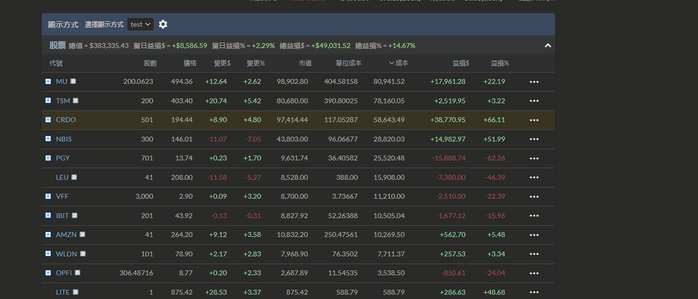

# 持股財報日曆

更新：2026-05-06

| 日期       | 代號     | 持倉佔比 | 重要程度  | 備註                      |
| ---------- | -------- | -------- | --------- | ------------------------- |
| 2026-04-29 | **NBIS** | 11.4%    | ⚠️ 高     | AI 雲端成長能否持續       |
| 2026-04-30 | **AMZN** | 2.8%     | ⚠️ 高     | AWS 是 AI 板塊風向球      |
| 2026-05-06 | LEU      | 2.2%     | 🟡 中     | 鈾濃縮，已虧損 -46%       |
| 2026-05-06 | LITE     | 0.2%     | 🟢 低     | 微倉                      |
| 2026-05-07 | PGY      | 2.5%     | ⚠️ 高     | 虧損最重 -62%，需決定去留 |
| 2026-05-07 | VST      | —        | 🟡 中     | 2 call options，電力/AI 資料中心主題 |
| 2026-05-08 | WLDN     | 2.1%     | 🟢 低     | 小倉                      |
| 2026-05-11 | VFF      | 2.3%     | 🟢 低     | 小倉                      |
| 2026-06-02 | **CRDO** | 25.4%    | 🔴 極重要 | 最大持倉，光通信核心      |
| 2026-06-25 | **MU**   | 25.8%    | 🔴 極重要 | 最大持倉，記憶體週期      |
| 2026-07-16 | **TSM**  | 21.1%    | 🔴 極重要 | 第三大持倉，晶圓代工      |
| —          | IBIT     | 2.3%     | —         | BTC ETF，無財報           |

## 重點提醒

- **NBIS 4/29**：後天出爐，注意 GPU 雲端營收成長與毛利趨勢
- **AMZN 4/30**：AWS 資本支出與 AI 需求指引，影響整個 AI 板塊情緒
- **PGY 5/7**：虧損 -62%，財報若無改善訊號考慮停損
- **CRDO + MU + TSM**：三個合計佔組合 72%，6–7 月是決定性時刻
