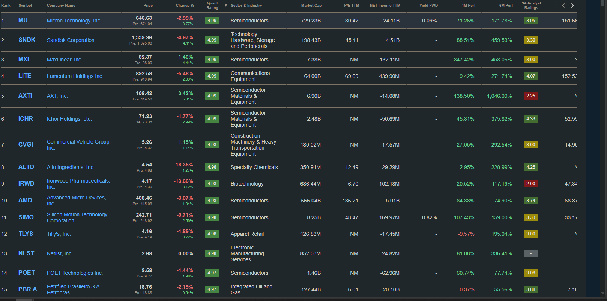

## Seeking Alpha 高 Quant Rating 清單分析（2026-05-08）

按 Quant Rating（4.97-4.99）排序，多數股票 6 個月漲幅 100%-1000%，追高風險極大。

---

### 半導體核心標的

| Ticker   | Price   | P/E   | Market Cap | 1M Perf | 6M Perf | SA Rating | 評語                                     |
| -------- | ------- | ----- | ---------- | ------- | ------- | --------- | ---------------------------------------- |
| **MU**   | $646.63 | 30.4  | $729B      | +71%    | +172%   | 3.95      | 記憶體龍頭，估值合理，已大漲但有獲利支撐 |
| **AMD**  | $408.46 | 136.2 | $666B      | +84%    | +75%    | 3.74      | P/E偏高，AI GPU 第二把交椅，短期漲幅已大 |
| **SIMO** | $242.71 | 48.5  | $8.25B     | +107%   | +159%   | 3.33      | NAND控制器，景氣循環受惠股，有股息       |
| **POET** | $9.58   | NM    | $1.46B     | +61%    | +78%    | 3.08      | 光電整合平台，虧損中，投機性較高         |

### 半導體材料/設備（上游）

| Ticker   | Price   | P/E | Market Cap | 1M Perf | 6M Perf | 評語                                          |
| -------- | ------- | --- | ---------- | ------- | ------- | --------------------------------------------- |
| **AXTI** | $108.42 | NM  | $6.9B      | +138%   | +1046%  | 化合物半導體基板，6個月漲10倍，極度投機       |
| **ICHR** | $71.23  | NM  | $2.48B     | +46%    | +376%   | 半導體設備流體系統，虧損中但景氣回升受惠      |
| **MXL**  | $82.37  | NM  | $7.38B     | +347%   | +458%   | 類比/混合訊號IC，短期暴漲需確認是否有併購事件 |

### 光通訊/通訊設備

| Ticker   | Price     | P/E   | Market Cap | 1M Perf | 6M Perf | SA Rating | 評語                                    |
| -------- | --------- | ----- | ---------- | ------- | ------- | --------- | --------------------------------------- |
| **LITE** | $892.58   | 169.7 | $64B       | +9%     | +272%   | 4.07      | 光通訊龍頭，AI datacenter受惠，估值已高 |
| **SNDK** | $1,339.96 | 45.1  | $198B      | +89%    | +460%   | 3.30      | 儲存大廠（原WDC分拆），景氣復甦受惠     |

### 非半導體（混入清單）

| Ticker    | 產業        | P/E  | 評語                                   |
| --------- | ----------- | ---- | -------------------------------------- |
| **CVGI**  | 商用車/重機 | NM   | 小市值$180M，虧損，波動大              |
| **ALTO**  | 特殊化學品  | 12.5 | 乙醇生產商，低P/E但產業平庸            |
| **IRWD**  | 生技        | 6.7  | 腸胃藥公司，低估值但成長有限           |
| **TLYS**  | 服飾零售    | NM   | 虧損小型零售，1個月還跌9%，不建議      |
| **NLST**  | 電子製造    | NM   | 靠專利訴訟的公司，高度投機             |
| **PBR.A** | 石油        | 6.0  | 巴西國營油企，高股息低估值，但政治風險 |

### POET Technologies (POET) 深入分析

**公司簡介：** 光電整合平台公司，核心產品為 POET Optical Interposer，可在單一晶片上整合電子與光子元件。應用場景包括 AI 資料中心光通訊、5G、LiDAR、醫療感測等。總部位於加拿大多倫多，員工僅 80 人。

| 項目           | 數據                 |
| -------------- | -------------------- |
| 現價（5/13）   | $14.19               |
| 市值           | $2.10B               |
| 52 週區間      | $3.87 - $15.50       |
| EPS (FWD)      | -$0.20（仍虧損）     |
| P/E            | NM                   |
| P/B (TTM)      | 9.86                 |
| EV/Sales (TTM) | 1,665.69（極高）     |
| 現金           | $313.4M              |
| 負債           | $7.07M               |
| Short Interest | 8.13%                |
| Beta           | 2.35                 |
| Altman Z Score | 0.98（破產風險區間） |

**Factor Grades：** Valuation D- / Growth B+ / Profitability D-

**SA Ratings：** SA Analysts = BUY, Wall Street = STRONG BUY, Quant = STRONG SELL

**動能（vs SP500）：**
| 3M | 6M | 9M | 12M |
| --- | --- | --- | --- |
| +143% | +172% | +169% | +208% |

**營收成長：** YoY +2,494%（從極低基期），3Y CAGR 24.8%，毛利率 100%（軟體/IP 授權型態）

**近期事件：**

- 5/12 新任 COO Sandeep Kumar（半導體老手）
- 4/27 股價從 $15.10 暴跌至 $7.95（單日 -47%），因 CFO Thomas Mika 言論引發 Marvell 合作疑慮
- CFO Mika 於 10/2025 大量賣出 $9.6M 持股（350K + 3.375M 股）

**風險：**

- 營收基期極低，EV/Sales 超過 1,600x，估值脆弱
- 內部人持續賣出（CFO、CRO、董事）
- Altman Z < 1.8 處於財務困境區間
- 高 Beta（2.35），波動極大
- Marvell 合作破局疑慮尚未完全消除

**看多論點：**

- Optical Interposer 技術獨特，具 AI 資料中心光互連潛力
- 現金充裕（$313M），幾乎無負債
- Wall Street 給 Strong Buy，2026 被視為營收起飛年
- 光通訊產業結構性成長趨勢

**結論：** 高度投機標的，技術有想像空間但尚未兌現營收。適合小倉位投機，需嚴設停損。觀察重點：Marvell 合作進展、Q2/Q3 營收是否放量。

### POET vs CRDO vs LITE 光通訊比較（2026-05-13）

| 項目                      | **POET**                           | **CRDO**                       | **LITE**                        |
| ------------------------- | ---------------------------------- | ------------------------------ | ------------------------------- |
| **公司**                  | POET Technologies                  | Credo Technology               | Lumentum Holdings               |
| **定位**                  | 光電整合平台（Optical Interposer） | 高速互連（AEC/SerDes/光學DSP） | 光通訊元件龍頭（EML/雷射/模組） |
| **現價**                  | $14.19                             | $190.25                        | $1,047.86                       |
| **市值**                  | $2.10B                             | $36.63B                        | $71.15B                         |
| **員工**                  | 80                                 | 622                            | 10,562                          |
| **P/E (FWD)**             | NM（虧損）                         | 59.95                          | 120.34                          |
| **P/B**                   | 9.86                               | 19.79                          | 23.93                           |
| **EV/Sales**              | 1,665.69                           | 33.09                          | 28.65                           |
| **EV/EBITDA**             | NM                                 | 100.90                         | 140.12                          |
| **毛利率**                | 100%（IP型態）                     | 67.83%                         | 40.84%                          |
| **淨利率**                | 虧損                               | 31.81%                         | 17.68%                          |
| **ROE**                   | -61.58%                            | 27.54%                         | 22.79%                          |
| **營收 YoY**              | +2,494%（極低基期）                | +226%                          | +69%                            |
| **營收 3Y CAGR**          | 24.8%                              | 77.93%                         | 11.02%                          |
| **現金**                  | $313M                              | $1.30B                         | $3.17B                          |
| **負債**                  | $7M                                | $16M                           | $3.31B                          |
| **Short Interest**        | 8.13%                              | 5.01%                          | 12.43%                          |
| **Beta**                  | 2.35                               | 3.41                           | 2.36                            |
| **Altman Z**              | 0.98 ⚠️                            | 60.54 ✅                       | 3.00 ✅                         |
| **12M 漲幅**              | +208%                              | +260%                          | +1,283%                         |
| **SA Analysts**           | BUY                                | BUY                            | BUY                             |
| **Wall Street**           | STRONG BUY                         | STRONG BUY                     | BUY                             |
| **Quant**                 | STRONG SELL                        | HOLD                           | HOLD                            |
| **Val / Growth / Profit** | D- / B+ / D-                       | F / A+ / B-                    | D- / A+ / C-                    |
| **EPS Revisions**         | 1 Up / 0 Down                      | 14 Up / 0 Down                 | 18 Up / 0 Down                  |

**關鍵差異：**

| 維度         | POET                  | CRDO                 | LITE                          |
| ------------ | --------------------- | -------------------- | ----------------------------- |
| **營收階段** | Pre-revenue（剛起步） | 高速成長期（已獲利） | 成熟轉型爆發（NVDA $2B 投資） |
| **護城河**   | 技術專利（未驗證）    | SerDes IP + 客戶黏性 | 產能+雷射技術+Nasdaq-100      |
| **風險等級** | 極高（Altman Z < 1）  | 中高（Beta 3.41）    | 中（Short 12%、高估值）       |
| **適合策略** | 投機小倉位            | 成長股核心持倉       | AI 光通訊龍頭配置             |

**總結：**

- **CRDO** 是三者中風險報酬比最佳：已獲利、營收高速成長、Altman Z 極健康，收購 DustPhotonics 進軍光學
- **LITE** 是最成熟的光通訊巨頭：Q4 營收指引 $960M-$1.01B，目標季營收 $2B，但估值最貴（P/E 120x）
- **POET** 最投機：技術有潛力但營收幾乎為零、EV/Sales > 1,600x，適合用期權或極小倉位參與

---

### 結論

- **值得關注（基本面有支撐）：** MU、LITE、PBR.A
- **高風險投機（隨時大幅回調）：** AXTI、MXL、NLST、POET
- **建議：** 等大幅回調 20-30% 再考慮進場，現階段適合列為觀察名單
